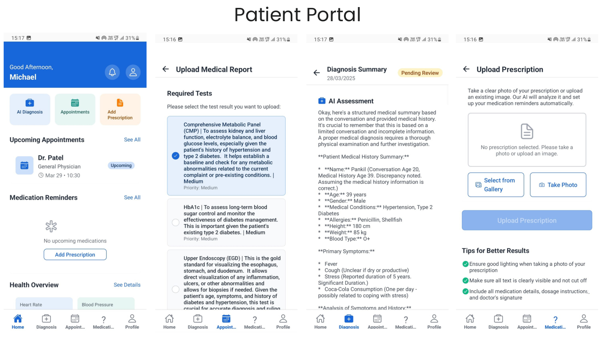
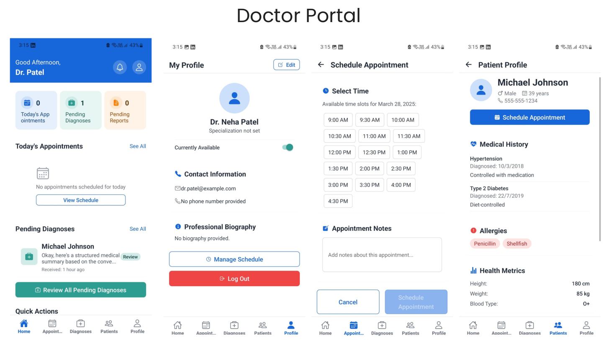

# 📱 HealthSync.ai - Mobile Client App

[](https://reactnative.dev/)
[](https://expo.dev/)
[](https://www.nativewind.dev/)
[](https://opensource.org/licenses/MIT)

> **HealthSync.ai** was built from the ground up for **`𝗛𝗲𝗮𝗹𝘁𝗵-𝗔-𝘁𝗵𝗼𝗻 𝟮𝟬𝟮𝟱`** to revolutionize clinical workflows. This repository hosts the Expo-based React Native Mobile Client supporting both iOS and Android.

---

## 👁️ Showcase & Presentation

To see HealthSync.ai in action, check out the clinical dashboards and review our team's vision presentation.

<div align="center">
  <h3>📊 Project Presentation</h3>
  <p>Discover our architectural vision, business model, and clinical impact studies.</p>
  <a href="assets/assets/presentation.pdf" target="_blank">
    
  </a>
</div>

<br/>

<div align="center">
  <h3>🩺 Patient Portal</h3>
  <p>AI-Powered triage, automated symptom assessments, and personalized diagnostic recommendations.</p>
  
</div>

<br/>

<div align="center">
  <h3>👨‍⚕️ Doctor Portal</h3>
  <p>Unified clinician queue, AI diagnostic approval/modification interfaces, and smart scheduler.</p>
  
</div>

---

## 🧠 The Problem & Our Solution

### 🧠 The Problem
Healthcare professionals are drowning in administrative overhead and fractured workflows. The current diagnostic journey involves:
- Multiple, disjointed patient visits just to request, analyze, and review basic tests.
- Clinical bottlenecks causing significant treatment delays.
- Doctors spending up to 40% of their day on administrative data entry rather than care.

### ✅ Our Solution
**HealthSync.ai** orchestrates a seamless, AI-integrated diagnostic loop:
* **Patients** upload reports/symptoms, and receive immediate AI-guided pre-analysis and test recommendations, saving **50% of workflow time** prior to their appointment.
* **Doctors** receive automatically aggregated diagnostic summaries, allowing them to review, tweak, and approve AI recommendations, boosting consultation speed by **40%**.

---

## 🛠️ What We Built (Mobile Features)

This cross-platform mobile client provides a custom user experience for both **Patients** and **Doctors**:

### 1. Patient Portal
- 📈 **Interactive Vitals Dashboard**: Monitor and visualize heart rate, blood glucose, and blood pressure with custom widgets and line graphs powered by `react-native-chart-kit`.
- 💬 **Gemini AI Diagnosis Chat**: Real-time AI consultation chat interface powered by `react-native-gifted-chat` for instant clinical symptom screening.
- 📄 **Report & Prescription Upload**: Take photos or pick PDFs directly from your device using `expo-image-picker` and `expo-document-picker`.
- ⏰ **Medication Reminders**: Manage daily pill schedules and receive local push notifications via `expo-notifications`.

### 2. Doctor Portal
- 📋 **Patient Queue & Detail View**: View complete medical summaries, active vitals, and report histories for all assigned patients.
- 🔍 **AI Recommendation Review**: View Gemini's automated test recommendations, and easily approve, edit, or append comments before signing off.
- 📅 **Schedule & Appointment Manager**: Keep track of scheduled calls and clinic check-ins with `react-native-calendars`.

---

## 🧱 Technical Architecture

### Key Libraries & Stack
* **Framework:** React Native (Expo SDK 52)
* **Styling:** TailwindCSS via NativeWind
* **Navigation:** React Navigation (Tabs, Drawers, Stacks)
* **Charts:** React Native Chart Kit
* **Forms & Logic:** Axios (Backend integration), AsyncStorage (Session persistency)

### Directory Structure
```
Healthsync-ai-mobile-app-frontend/
├── assets/                  # App images (icon, logo, splash)
│   └── assets/              # Hackathon Showcase assets (Screenshots, PDFs)
├── src/
│   ├── api/                 # Endpoint client services (Axios configs)
│   ├── components/          # Reusable components (Vitals card, appointment card, buttons)
│   ├── context/             # Global AuthContext & theme state management
│   ├── navigation/          # Navigation flows (Auth stack, Doctor tabs, Patient tabs/drawer)
│   └── screens/             # Screen modules
│       ├── auth/            # Onboarding, Login, Register, Forgot Password
│       ├── doctor/          # Doctor Homescreen, Appointments, Diagnosis Detail, Patient Details
│       └── patient/         # Health Dashboard, Vitals Tracker, AI Chat, Upload Report
```

---

## 🚀 Getting Started

### 📋 Prerequisites
- **Node.js** (v18.0.0 or higher)
- **Expo Go** app installed on your physical mobile device, OR Android Studio Emulator / iOS Simulator.

### 🔧 Installation & Run

1. **Clone the repository:**
   ```bash
   git clone https://github.com/NeelDevenShah/Healthsync-ai-mobile-app-frontend.git
   cd Healthsync-ai-mobile-app-frontend
   ```

2. **Install dependencies:**
   ```bash
   npm install
   ```

3. **Configure Environment Variables:**
   Create a `.env` file in the root directory:
   ```env
   API_URL=http://localhost:5000/api
   ```
   *(Note: Replace `localhost` with your machine's local IP address if running on a physical phone via Expo Go).*

4. **Start the Expo server:**
   ```bash
   npx expo start
   ```

5. **Run the App:**
   - Scan the QR code with **Expo Go** (Android) or your camera app (iOS) to test on a physical phone.
   - Press `a` for Android Emulator.
   - Press `i` for iOS Simulator.

---

## 🔗 Related Repositories

This is the **Mobile Frontend Client** repository for HealthSync.ai.

* 🖥️ **Backend API Repository**: Visit the [HealthSync AI App Backend](https://github.com/NeelDevenShah/Healthsync-ai-app-backend) to set up the Node.js/Express service.

---

## 👥 Team ML Mavericks

Developed with passion at **Health-A-Thon 2025**:
* **Neel Shah** - [neeldevenshah.ai@gmail.com](mailto:neeldevenshah.ai@gmail.com)
* **Pankil Soni** - [pmsoni2016@gmail.com](mailto:pmsoni2016@gmail.com)
* **Sneh Shah** - [snehs5483@gmail.com](mailto:snehs5483@gmail.com)

---

## 📄 License
This project is licensed under the MIT License - see the [LICENSE](LICENSE) file for details.
